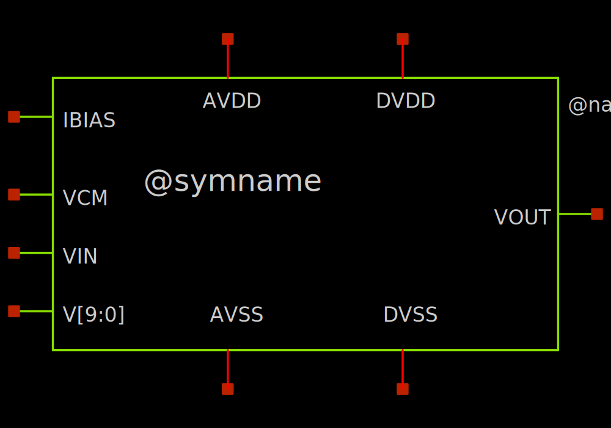
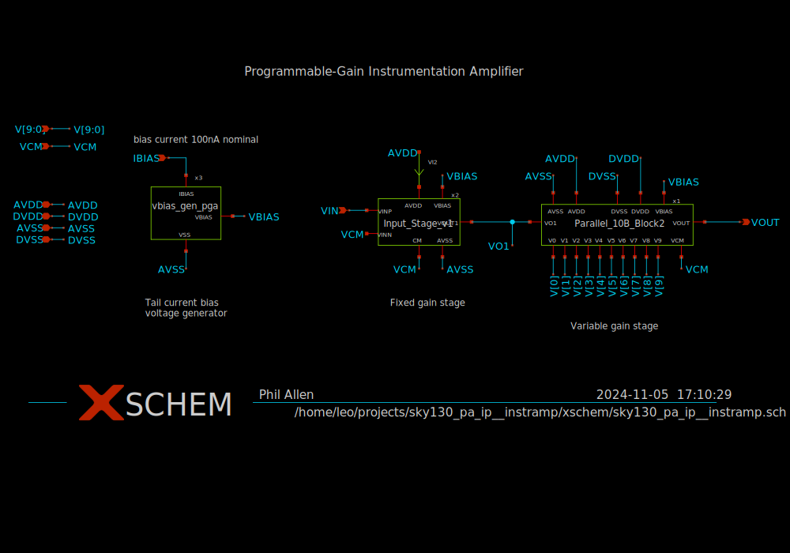
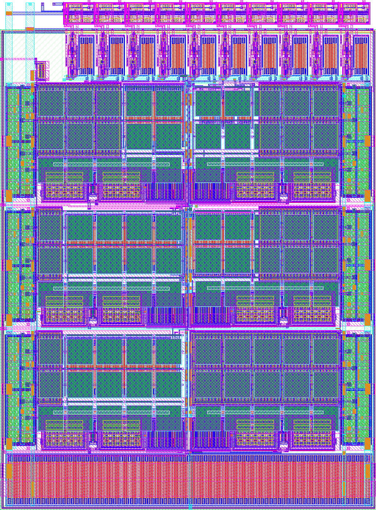
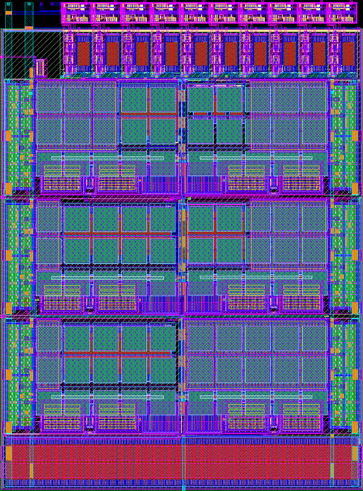

# sky130_pa_ip__instramp

- Description: Instrumentation amplifier
- PDK: sky130A

## Authorship

- Designer: Phil Allen
- Created: November 5, 2024
- License: Apache 2.0
- Company: None
- Last modified: None

## Pins

- VCM
  + Description: Common mode voltage
  + Type: signal
  + Direction: input
- IBIAS
  + Description: bias current 100nA nominal
  + Type: signal
  + Direction: input
- V[9:0]
  + Description: digital value
  + Type: signal
  + Direction: input
- VIN
  + Description: amplifier voltage input
  + Type: signal
  + Direction: input
- VOUT
  + Description: amplifier voltage output
  + Type: signal
  + Direction: output
- AVDD
  + Description: Analog power supply
  + Type: power
  + Direction: inout
- AVSS
  + Description: Analog ground
  + Type: ground
  + Direction: inout
- DVDD
  + Description: Digital power supply
  + Type: power
  + Direction: inout
- DVSS
  + Description: Digital ground
  + Type: ground
  + Direction: inout

## Default Conditions

- Vavdd
  + Description: Analog power supply voltage
  + Display: avdd
  + Unit: V
  + Typical: 3.3
- Vavss
  + Description: Analog ground
  + Display: avss
  + Unit: V
  + Typical: 0
- Vdvdd
  + Description: Digital power supply voltage
  + Display: dvdd
  + Unit: V
  + Typical: 1.8
  + Note: Reference voltage for the enable input
- Vdvss
  + Description: Digital ground
  + Display: dvss
  + Unit: V
  + Typical: 0
- Ibias
  + Description: bias current 100nA nominal
  + Display: Ibias
  + Unit: nA
  + Typical: 100
- V[9:0]
  + Description: Digital value of the gain
  + Display: V
  + Typical: 1023
- Rout
  + Description: Output load resistance
  + Display: RLoad
  + Unit: MΩ
  + Typical: 100
- Cout
  + Description: Output load capacitance
  + Display: CLoad
  + Unit: fF
  + Maximum: 100
- Vcm
  + Description: Common-mode input voltage
  + Display: Vcm
  + Typical: 1.65
- Vdiff
  + Description: Differential input voltage
  + Display: Vdiff
  + Typical: 0
- temperature
  + Description: Ambient temperature
  + Display: Temp
  + Unit: °C
  + Minimum: -40
  + Typical: 27
  + Maximum: 130
- corner
  + Description: Process corner
  + Display: Corner
  + Minimum: ss
  + Typical: tt
  + Maximum: ff
- iterations
  + Description: Iterations to run
  + Display: Iterations
  + Minimum: 1
  + Maximum: 10
  + Step: linear
  + Stepsize: 1

## Symbol

## Schematic

## Layout

